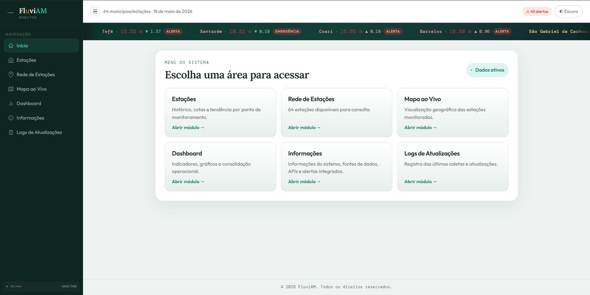
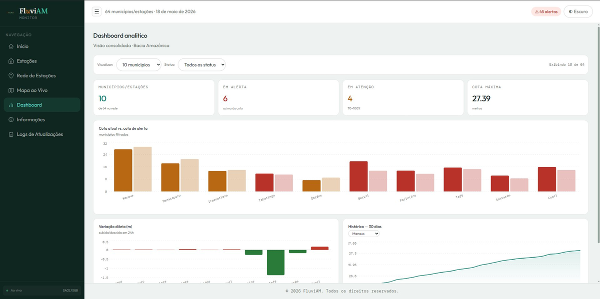
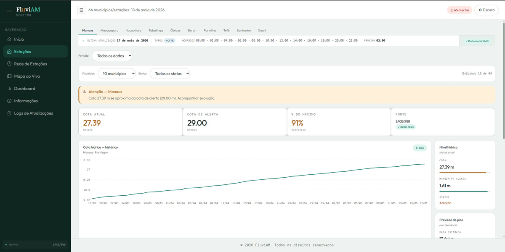
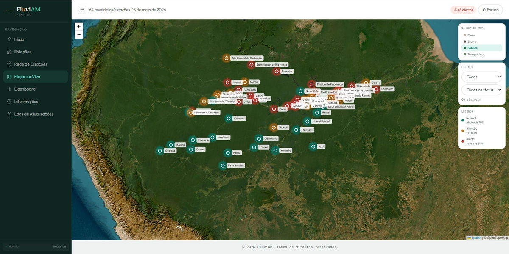

# 🌊 FluviAM Monitor

[](https://www.python.org/)
[](https://fastapi.tiangolo.com/)
[](https://reactjs.org/)
[](https://vitejs.dev/)
[](LICENSE)
[]()

> Plataforma de monitoramento hidrológico em tempo real para a Bacia Amazônica, com 64 municípios/estações monitorados, alertas integrados e visualização geográfica interativa.

---

## 📋 Índice

- [Visão Geral](#visão-geral)
- [Screenshots](#screenshots)
- [Funcionalidades](#funcionalidades)
- [Tecnologias Utilizadas](#tecnologias-utilizadas)
- [Estrutura do Projeto](#estrutura-do-projeto)
- [Instalação](#instalação)
- [Configuração](#configuração)
- [Como Executar](#como-executar)
- [API](#api)
- [Testes](#testes)
- [Roadmap](#roadmap)
- [Contribuição](#contribuição)
- [Licença](#licença)

---

## Visão Geral

O **FluviAM Monitor** é um sistema de monitoramento hidrológico desenvolvido para acompanhar em tempo real as cotas (níveis) dos rios da Bacia Amazônica, com foco no estado do Amazonas. O sistema integra dados de múltiplas fontes oficiais — SACE/SGB, ANA HidroWebService, INMET, CEMADEN e Open-Meteo — e apresenta as informações em um dashboard analítico moderno com mapa ao vivo, histórico de 30/60 dias, variação diária e sistema de alertas automáticos.

### O que ele resolve

- Centraliza dados hidrológicos de fontes distintas em uma única interface
- Automatiza a detecção de situações de **atenção** (70–100% da cota máxima) e **alerta** (acima da cota de alerta)
- Disponibiliza um ticker em tempo real com o status dos municípios mais críticos
- Permite acompanhar a tendência mensal e previsão de pico de cheia para cada estação
- Oferece visualização geográfica com filtros por status (Normal / Atenção / Alerta / Emergência)

### Principais casos de uso

- Gestão de defesa civil e órgãos ambientais do Amazonas
- Pesquisa hidrológica acadêmica e monitoramento de enchentes
- Jornalismo e comunicação sobre eventos climáticos extremos na Amazônia

---

## Screenshots

### Página Inicial


### Dashboard Analítico


### Estações — Detalhe por Município


### Mapa ao Vivo


---

## Funcionalidades

### 🗺️ Mapa ao Vivo
- Visualização geográfica interativa (Leaflet) de todas as 64 estações monitoradas
- Camadas de mapa: Claro, Escuro, Satélite e Topográfico
- Marcadores coloridos por status: Verde (Normal), Âmbar (Atenção), Vermelho (Alerta)
- Filtros por rio e por status de alerta

### 📊 Dashboard Analítico
- Resumo consolidado: total de municípios, em alerta, em atenção e cota máxima registrada
- Gráfico de barras: cota atual vs. cota de alerta por município
- Gráfico de variação diária (subida/descida nas últimas 24h)
- Histórico de 30 dias com seleção de estação

### 🏙️ Estações — Detalhe por Município
- Aba com navegação por município (Manaus, Manacapuru, Itacoatiara, Tabatinga, Óbidos, Beruri, Parintins, Tefé, Santarém, Coari e outros)
- Banner de atenção/alerta com mensagem contextual
- Métricas: cota atual, cota de alerta, % do máximo histórico e fonte dos dados
- Gráfico de histórico da cota hídrica (até 61 dias)
- Painel lateral: nível hídrico, margem para alerta, status e previsão de pico por tendência
- Horários de atualização e turno (noite/manhã/tarde)

### 🔔 Alertas Integrados
- Coleta automática a cada 2 horas de múltiplas fontes
- INMET: Avisos meteorológicos via RSS/CAP
- CEMADEN: Painel público de alertas
- Open-Meteo Flood: Previsão de vazão/descarga
- ANA HidroWebService: Alertas de cota/chuva/vazão por estação (requer credenciais)
- Ticker ao vivo no topo da página com municípios em situação crítica

### ⚡ Ticker em Tempo Real
- Barra rolante contínua com cota atual, variação e status de cada estação
- Atualiza automaticamente a cada 2 horas (configurável)

### 🌙 Tema Escuro / Claro
- Alternância de tema via botão na interface, com persistência visual

### 🗃️ Sistema de Cache com Fallback
- Dados cacheados localmente em JSON para garantir disponibilidade mesmo sem conexão com as APIs externas
- Fallback automático para dados locais quando a coleta falha

---

## Tecnologias Utilizadas

### Backend
| Tecnologia | Versão | Função |
|---|---|---|
| Python | 3.14+ | Linguagem principal |
| FastAPI | 0.104+ | Framework da API REST |
| Uvicorn | 0.24+ | Servidor ASGI |
| Pandas | 3.0+ | Processamento e análise de dados |
| NumPy | 2.4+ | Cálculos numéricos |
| Requests | 2.33+ | Consumo de APIs externas |
| python-dotenv | 1.0+ | Gerenciamento de variáveis de ambiente |

### Frontend
| Tecnologia | Versão | Função |
|---|---|---|
| React | 18.2 | Framework de UI |
| Vite | 4.4 | Bundler e dev server |
| Axios | 1.6 | Requisições HTTP |
| Recharts | 2.8 | Gráficos de linha, barra e área |
| Leaflet | (HTML estático) | Mapa geográfico interativo |

### APIs e Fontes de Dados Externas
| Fonte | Tipo | Dados |
|---|---|---|
| **SACE/SGB** | API pública (CSV) | Cotas reais a cada 15 minutos |
| **ANA HidroWebService** | API autenticada | Telemetria, chuva e vazão |
| **INMET** | RSS/CAP público | Avisos meteorológicos |
| **CEMADEN** | Painel público | Alertas de desastres naturais |
| **Open-Meteo Flood** | API pública | Previsão de vazão/descarga fluvial |

---

## Estrutura do Projeto

```
Projeto-FluviAM/
├── .env                          # Variáveis de ambiente (não versionar)
├── .env.example                  # Template de variáveis de ambiente
├── requirements.txt              # Dependências Python (pip)
├── pyproject.toml                # Metadados do projeto Python
│
├── backend/                      # Servidor FastAPI
│   ├── server.py                 # Ponto de entrada da API (FastAPI app)
│   ├── src/
│   │   ├── config.py             # Configurações globais e cadastro das 64 estações
│   │   ├── api.py                # Integração com SACE, ANA, Open-Meteo
│   │   ├── main.py               # Lógica principal: tendência mensal, processamento
│   │   ├── alertas_integrados.py # Coleta e cache de alertas (INMET, CEMADEN, ANA, Open-Meteo)
│   │   ├── dados_cache.py        # Gerenciamento do cache de dados hidrológicos
│   │   ├── processamento.py      # Utilitários de processamento de dados
│   │   └── utils.py              # Funções auxiliares gerais
│   └── data/
│       ├── dados_hidrologicos_cache.json  # Cache das cotas (gerado automaticamente)
│       ├── alertas_integrados.json        # Cache dos alertas (gerado automaticamente)
│       └── fallback.json                  # Dados de fallback para operação offline
│
├── frontend/                     # Interface React
│   ├── index.html                # Entry HTML
│   ├── vite.config.js            # Configuração do Vite (proxy para :5000)
│   ├── package.json              # Dependências Node.js
│   ├── src/
│   │   ├── App.jsx               # Componente principal (toda a UI em um arquivo)
│   │   └── main.jsx              # Ponto de entrada React
│   ├── public/
│   │   └── dashboard.html        # Dashboard HTML estático (alternativo)
│   └── dist/                     # Build de produção (gerado pelo Vite)
│
└── tests/
    ├── test_api.py               # Suite de testes pytest (endpoints e integração)
    └── README_TESTES.md          # Guia de execução dos testes
```

---

## Instalação

### Pré-requisitos

- Python 3.14 ou superior
- Node.js 18+ e npm
- Git

### 1. Clone o repositório

```bash
git clone https://github.com/seu-usuario/Projeto-FluviAM.git
cd Projeto-FluviAM
```

### 2. Configure o ambiente Python

```bash
# Crie e ative um ambiente virtual (recomendado)
python -m venv .venv

# Linux/macOS
source .venv/bin/activate

# Windows
.venv\Scripts\activate

# Instale as dependências
pip install -r requirements.txt
```

### 3. Configure o ambiente Node.js (frontend)

```bash
cd frontend
npm install
cd ..
```

---

## Configuração

Copie o arquivo de exemplo e preencha as variáveis:

```bash
cp .env.example .env
```

Edite o arquivo `.env`:

```env
# ANA HidroWebService — requer cadastro na ANA (opcional, mas recomendado)
ANA_BASE_URL=https://www.ana.gov.br/hidrowebservice/EstacoesTelemetricas
ANA_CPF_CNPJ=seu_cpf_ou_cnpj
ANA_SENHA=sua_senha

# Configurações gerais
TIMEOUT=30              # Timeout das requisições externas (segundos)
DIAS_ANALISE=60         # Janela histórica padrão em dias
VAZAO_MINIMA=0          # Filtro de vazão mínima

# Intervalo de atualização automática (horas)
DADOS_INTERVALO_HORAS=2
ALERTAS_INTERVALO_HORAS=2

# Fontes públicas — não requerem credenciais
INMET_AVISOS_RSS_URL=https://apiprevmet3.inmet.gov.br/avisos/rss/45736
CEMADEN_ALERTAS_URL=https://painelalertas.cemaden.gov.br/
FLOOD_URL=https://flood-api.open-meteo.com/v1/flood
```

> **Nota:** As credenciais da ANA (`ANA_CPF_CNPJ` e `ANA_SENHA`) são opcionais. Sem elas, o sistema opera com SACE/SGB (público), Open-Meteo e dados de fallback local.

---

## Como Executar

### Backend (API FastAPI)

```bash
# Na raiz do projeto
uvicorn backend.server:app --host 0.0.0.0 --port 5000 --reload
```

A API estará disponível em: `http://localhost:5000`

Documentação automática (Swagger): `http://localhost:5000/docs`

### Frontend (desenvolvimento)

```bash
cd frontend
npm run dev
```

O frontend estará disponível em: `http://localhost:5173`

> O Vite está configurado com proxy: todas as chamadas para `/api` são redirecionadas automaticamente para `http://localhost:5000`.

### Frontend (build de produção)

```bash
cd frontend
npm run build
# Os arquivos estáticos serão gerados em frontend/dist/
```

### Servir o frontend estático (sem Node)

```bash
# Da raiz do projeto, usando Python
python -m http.server 8000 --directory frontend/dist
```

### Executar ambos simultaneamente (exemplo com terminais separados)

```bash
# Terminal 1 — Backend
uvicorn backend.server:app --port 5000 --reload

# Terminal 2 — Frontend
cd frontend && npm run dev
```

### Scripts disponíveis (frontend)

```bash
npm run dev        # Servidor de desenvolvimento com HMR
npm run build      # Build otimizado para produção
npm run preview    # Preview do build de produção
npm run lint       # Verificação de lint (ESLint)
```

---

## API

O backend expõe uma API REST na porta `5000`. Todos os endpoints retornam JSON.

### Endpoints principais

#### `GET /api/estacoes`
Retorna a lista de todas as estações monitoradas e metadados.

```json
{
  "estacoes": ["Manaus", "Manacapuru", "..."],
  "total": 64,
  "municipios_amazonas": ["Manaus", "..."],
  "total_municipios_amazonas": 62,
  "estacoes_apoio_fora_am": ["Óbidos", "Santarém"],
  "metadata": { "Manaus": { "lat": -3.10, "lon": -60.02, "rio": "Rio Negro", ... } }
}
```

#### `GET /api/dados`
Retorna dados hidrológicos (cotas diárias) de todas as estações ou de uma específica.

**Parâmetros opcionais:**
| Parâmetro | Tipo | Descrição |
|---|---|---|
| `estacao` | string | Nome da estação (ex: `Manaus`) |
| `dias` | int | Número de dias anteriores |
| `data_inicio` | date | Data de início (`YYYY-MM-DD`) |
| `data_fim` | date | Data de fim (`YYYY-MM-DD`) |
| `force` | bool | Força nova coleta ignorando cache |

```bash
GET /api/dados?estacao=Manaus&dias=30
```

#### `GET /api/dados/tempo-real`
Retorna leituras horárias direto do SACE (útil para cota atual e variação recente).

```bash
GET /api/dados/tempo-real?estacao=Manaus&horas=48
```

#### `GET /api/dados/cache-info`
Retorna metadados do cache hidrológico (timestamp, validade, etc.).

#### `GET /api/alertas-integrados`
Retorna alertas consolidados de todas as fontes integradas.

```bash
GET /api/alertas-integrados          # Usa cache
GET /api/alertas-integrados?force=true  # Força nova coleta
```

#### `POST /api/alertas-integrados/coletar`
Força uma nova coleta imediata dos alertas integrados.

#### `GET /api/fontes-alerta`
Lista as bases de alerta integradas e se requerem credenciais.

---

## Testes

O projeto inclui uma suite de testes com `pytest`.

### Instalação

```bash
pip install pytest requests
```

### Executar todos os testes

```bash
pytest tests/test_api.py -v
```

### Executar uma classe específica

```bash
pytest tests/test_api.py::TestEstacionesEndpoint -v
pytest tests/test_api.py::TestDadosEndpoint -v
pytest tests/test_api.py::TestCORSHeaders -v
```

### Cobertura dos testes

| Classe | O que valida |
|---|---|
| `TestEstacionesEndpoint` | Status 200, estrutura de resposta, presença de todos os municípios do AM |
| `TestDadosEndpoint` | Status 200, JSON válido, estrutura completa dos dados, tipos corretos |
| `TestCORSHeaders` | Headers CORS presentes (`Allow-Origin`, `Allow-Methods`) |
| `test_integration_flow` | Fluxo completo: obtém estações → obtém dados → valida consistência |

### Saída esperada

```
tests/test_api.py::TestEstacionesEndpoint::test_get_estacoes_status_200 PASSED
tests/test_api.py::TestDadosEndpoint::test_get_dados_status_200 PASSED
...
======================== 12 passed in 0.42s ========================
```

> **Pré-requisito:** o backend deve estar rodando em `http://localhost:5000` antes de executar os testes.

---

## Fontes de Dados

| Fonte | Acesso | Dados fornecidos |
|---|---|---|
| **SACE/SGB** | Público (sem credenciais) | Cotas a cada 15 min via CSV |
| **ANA HidroWebService** | Credenciais obrigatórias | Telemetria, chuva, vazão por estação |
| **INMET** | Público (RSS) | Avisos meteorológicos do Amazonas |
| **CEMADEN** | Público | Alertas de desastres naturais |
| **Open-Meteo Flood** | Público (não comercial) | Previsão de descarga/vazão fluvial |

O sistema opera em modo degradado com dados de fallback local (`backend/data/fallback.json`) quando as APIs externas estão indisponíveis.

---

## Roadmap

- [ ] Autenticação de usuários e controle de acesso por perfil
- [ ] Notificações push / e-mail automáticas quando uma estação entra em alerta
- [ ] Exportação de dados em CSV/XLSX pela interface
- [ ] Integração com API do CEMADEN para dados estruturados (além do painel público)
- [ ] Suporte a dados de chuva acumulada por estação
- [ ] Versão mobile-first / PWA
- [ ] Deploy dockerizado com `docker-compose`
- [ ] Dashboard público com embed para prefeituras e defesa civil

---

## Contribuição

Contribuições são bem-vindas! Para contribuir:

1. Faça um fork do projeto
2. Crie uma branch para sua feature: `git checkout -b feature/minha-feature`
3. Faça commit das alterações: `git commit -m 'feat: adiciona minha feature'`
4. Envie para o repositório remoto: `git push origin feature/minha-feature`
5. Abra um Pull Request descrevendo as mudanças

### Padrões de commit (sugerido)

```
feat:     nova funcionalidade
fix:      correção de bug
docs:     alteração de documentação
refactor: refatoração sem mudança de comportamento
test:     adição ou correção de testes
chore:    tarefas de manutenção
```

---

## Licença

Este projeto está licenciado sob a [Licença MIT](LICENSE).

---

## Autor

Desenvolvido com foco em monitoramento hidrológico da Bacia Amazônica.  
Dados fornecidos por: **SACE/SGB · ANA · INMET · CEMADEN · Open-Meteo**

---

*© 2026 FluviAM Monitor. Todos os direitos reservados.*
